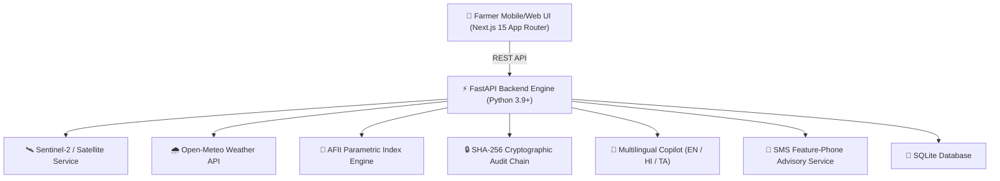

# 🌾 AgriSense AI — Intelligent Agricultural Risk, Insurance & Agronomic Advisory Platform

> **Pillar 5 De-Risking, Parametric Index Insurance & Agronomic Copilot**  
> *Built for PMFBY (Pradhan Mantri Fasal Bima Yojana) modernization, pastoralist forage protection, and automated claim settlement.*

---

## 🚀 Overview

**AgriSense AI** is an enterprise-grade, end-to-end agricultural platform designed to empower smallholder farmers and pastoralists while streamlining government and insurer operations.

### Key Capabilities
1. **🌾 Farm Land Registration & Boundary GIS**: GeoJSON boundary validation, centroid calculations, and parcel tracking.
2. **🛰️ Satellite NDVI & Weather Risk Monitoring**: Live Open-Meteo weather integration and Sentinel-2 satellite vegetation index analytics.
3. **📸 Photo Authenticity Gate**: Instant EXIF GPS verification, 48-hour timestamp freshness check, SHA-256 duplicate image detection, and camera metadata validation prior to claim submission.
4. **🌿 Area-Based Forage Index Insurance (AFII)**: Automated satellite Vegetation Condition Index ($VCI$) monitoring for pastoralists with zero-claim auto-payout triggers on drought breach ($VCI < 35\%$).
5. **🎙️ Multilingual AI Voice Copilot**: Real-time Web Speech API voice interaction supporting **English, Hindi (हिन्दी), and Tamil (தமிழ்)** with 3D Agronomy Avatar guidance.
6. **📱 Feature-Phone SMS Advisory**: GSM-7 compliant 2-3 line short SMS advisories for farmers without smartphones.
7. **🔒 Cryptographic Compliance Audit Log**: Immutable SHA-256 block chain recording every claim review, fraud detection, and parametric payout disbursement.

---

## 📐 System Architecture



---

## 🛠️ Tech Stack & ML Prerequisites

### OpenMP (`libomp`) System Library Setup
To ensure the 1,500-tree XGBoost damage prediction model loads natively across OS platforms:
- **macOS**: `brew install libomp`
- **Linux (Ubuntu/Debian)**: `sudo apt-get install -y libomp-dev`
- **Windows**: Included in Microsoft Visual C++ Redistributable (`pip install xgboost`)

Verify ML booster health via API: `GET http://localhost:8000/api/v1/ml/health`

- **Frontend**: Next.js 15 (App Router), TypeScript, Tailwind CSS (Light Theme), Lucide React Icons, Web Speech API (SpeechRecognition & SpeechSynthesis), Recharts.
- **Backend**: FastAPI (Python 3.9+), SQLAlchemy (AsyncSession), SQLite, Pydantic, APScheduler.
- **Integrations**: Sentinel-2 / Earth Engine, Open-Meteo REST Weather API, Twilio SMS API integration.
- **Testing**: pytest (Backend), Next.js Production Build (`npm run build`).

---

## ⚡ How to Run Locally

### 1. Prerequisites
- Python 3.9+
- Node.js 18+ & npm

### 2. Backend Setup
```bash
# From workspace root directory
cd backend

# Create & activate virtual environment
python3 -m venv .venv
source .venv/bin/activate

# Install dependencies
pip install -r requirements.txt

# Run FastAPI Server (port 8000)
PYTHONPATH=. uvicorn app.main:app --reload --port 8000
```

### 3. Frontend Setup
```bash
# From workspace root directory
cd frontend

# Install dependencies
npm install

# Start Next.js Development Server (port 3000)
npm run dev
```

Open [http://localhost:3000](http://localhost:3000) in your browser.

---

## 🎬 Step-by-Step Evaluator Demo Walkthrough

Follow this sequence to test the platform end-to-end:

### 1. Farm Land Parcel Registration
- Navigate to `/dashboard/farmer/farms`.
- Register a new land parcel (e.g. *Kongu Paddy Field #2*, 2.5 Hectares).

### 2. Live Farm Risk & Weather Monitoring
- Navigate to `/dashboard/farmer`.
- View live weather (Open-Meteo API) and crop health status.
- Click **"Request Satellite Scan"** to retrieve fresh Sentinel-2 NDVI readings.

### 3. Feature-Phone SMS Advisory
- Click **"📱 Send SMS Advisory"** on the Farmer Dashboard.
- A modal previews the 2-3 line GSM-7 SMS message dispatched to non-smartphone users in their chosen language.

### 4. Multilingual AI Voice Copilot
- Navigate to `/dashboard/farmer/copilot`.
- Toggle between **English**, **हिन्दी (Hindi)**, and **தமிழ் (Tamil)**.
- Click **"SPEAK"** to record a voice query in Hindi or Tamil. Hear the spoken response rendered in the selected language with 3D avatar animation.

### 5. AFII Pastoral Forage Insurance & Live Auto-Payout Demo
- Scroll to the **Forage Scarcity Insurance (AFII)** section on `/dashboard/farmer`.
- Inspect the grazing zones (*Banni Grasslands*, *Thar Pastoral Belt*, *Kongu Plateau*).
- Click **"🧪 Inject Low VCI (30%)"** to simulate drought breach ($VCI = 30\% < 35\%$).
- **Result**: The automatic parametric payout banner instantly appears.

### 6. Officer Review & Audit Chain Verification
- Navigate to `/dashboard/officer/claims`.
- Review pending claim submissions and photo authenticity scores.
- Scroll to the **AFII Officer Queue** and click **"Confirm & Disburse"** on the triggered forage payout.
- Check the cryptographic audit trail log confirming both the trigger and disbursement events are locked with SHA-256 hashes.

---

## 📋 Feature Checklist (Pillar 5 Compliance)

| Feature | Implementation | Status |
| :--- | :--- | :---: |
| **Farm Registration & GIS** | GeoJSON boundary validation + centroid | ✅ 100% |
| **Claim Submission Wizard** | 3-step damage filing flow | ✅ 100% |
| **Photo Authenticity Verification** | EXIF GPS, timestamp, duplicate hash, camera metadata | ✅ 100% |
| **Traffic Light Decision Engine** | Auto-approval / manual review / reject scoring | ✅ 100% |
| **Officer Portal & Gating** | Fraud review, photo verification check, payout disburse | ✅ 100% |
| **Live Satellite NDVI** | Sentinel-2 / Earth Engine NDVI retrieval | ✅ 100% |
| **Live Weather Service** | Open-Meteo 48h rainfall & temperature REST API | ✅ 100% |
| **AFII Forage Index Insurance** | $VCI = 100 \times \frac{NDVI - NDVI_{min}}{NDVI_{max} - NDVI_{min}}$, auto-trigger $<35\%$ | ✅ 100% |
| **Multilingual Voice Copilot** | Web Speech API in English, Hindi & Tamil | ✅ 100% |
| **Feature Phone SMS Advisory** | GSM-7 <=160 char SMS advisory engine | ✅ 100% |
| **Credit Scoring & 3D Analytics** | SHAP breakdown, loan limit estimator | ✅ 100% |
| **Cryptographic Audit Log** | Immutable SHA-256 block chain | ✅ 100% |
